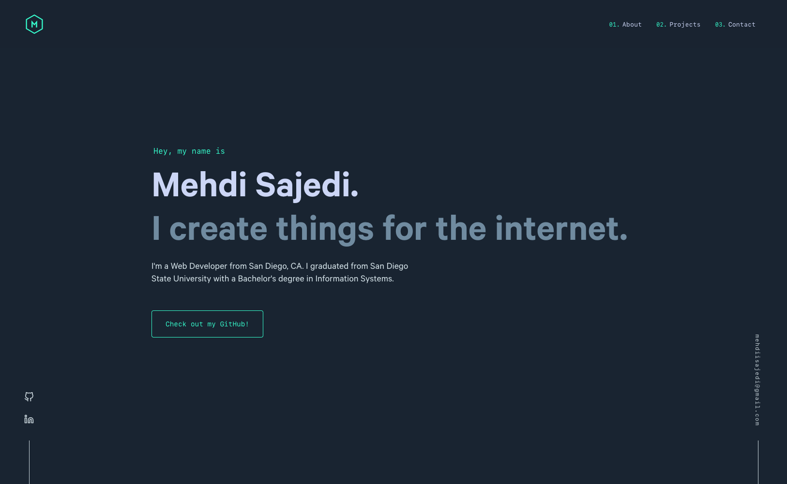

<div align="center">
  
</div>

<h1 align="center">
  Mehdi Sajedi's Portfolio Website
</h1>

<p align="center">
  <a href="https://app.netlify.com/sites/mehdisajedi/deploys" target="_blank">
    
  </a>
</p>

<p>
  Demo: <a href='https://mehdisajedi.netlify.app'>mehdisajedi.netlify.app</a>
</p>

<p>Adapted from <a href='https://github.com/bchiang7/v4'>Brittany Chiang's design on GitHub</a></p>

<!--  -->



## 🛠 Installation & Set Up

1. Install the Gatsby CLI

   ```sh
   npm install -g gatsby-cli
   ```

2. Install and use the correct version of Node using [NVM](https://github.com/nvm-sh/nvm)

   ```sh
   nvm install
   ```

3. Install dependencies

   ```sh
   yarn
   ```

4. Start the development server

   ```sh
   npm start
   ```

## 🚀 Building and Running for Production

1. Generate a full static production build

   ```sh
   npm run build
   ```

1. Preview the site as it will appear once deployed

   ```sh
   npm run serve
   ```

## 🎨 Color Reference

| Color          | Hex                                                                |
| -------------- | ------------------------------------------------------------------ |
| Navy           |  `#192431` |
| Dark Navy      |  `#020c1b` |
| Light Navy     |  `#1f2f41` |
| Lightest Navy  |  `#3b4b5d` |
| Slate          |  `#d6e4ea` |
| Dark Slate     |  `#495670` |
| Light Slate    |  `#cbd7dd` |
| Lightest Slate |  `#ccd6f6` |
| White          |  `#e6f1ff` |
| Green          |  `#37ffcf` |
